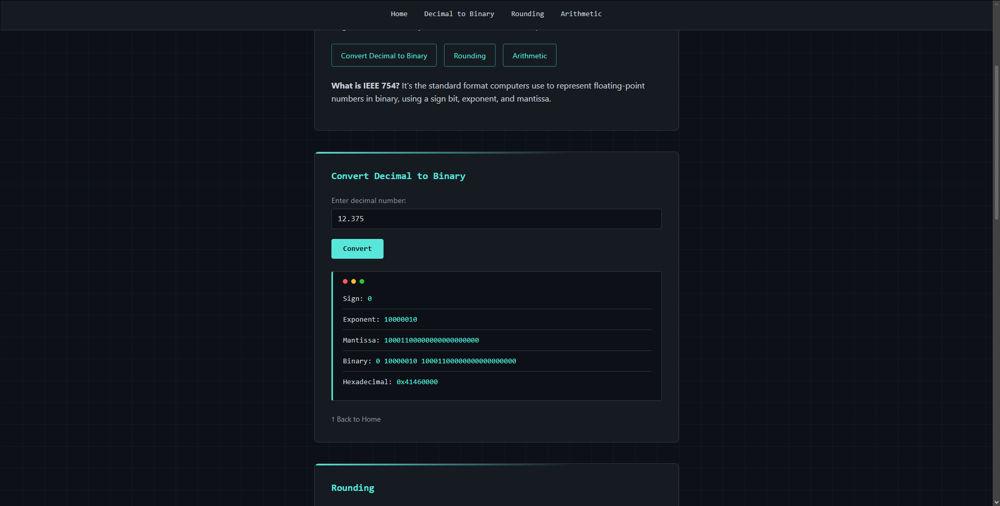
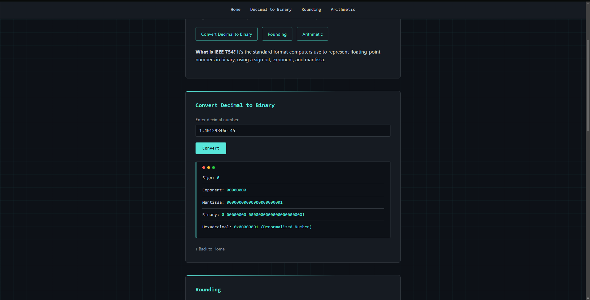
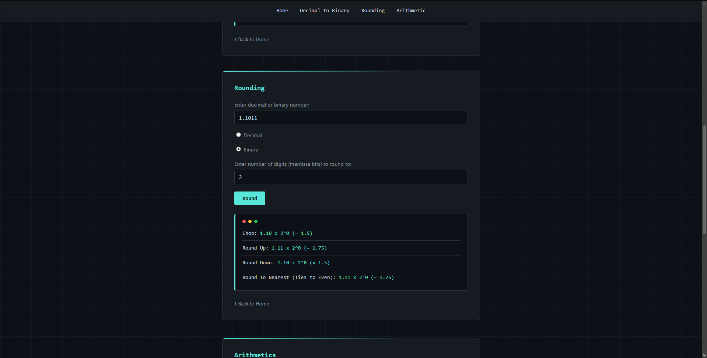
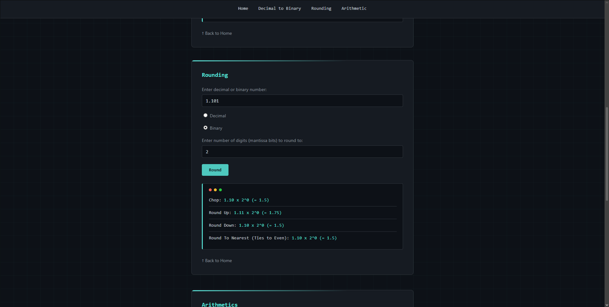
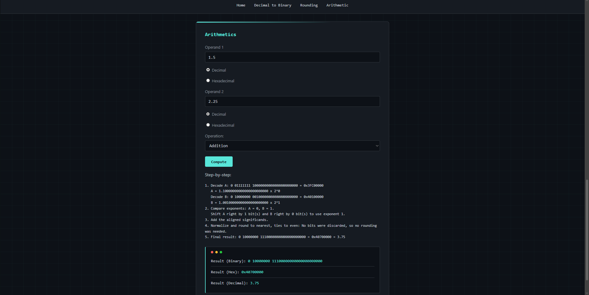
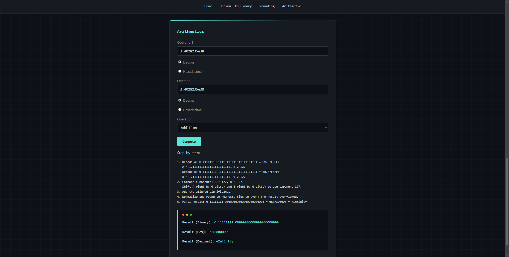
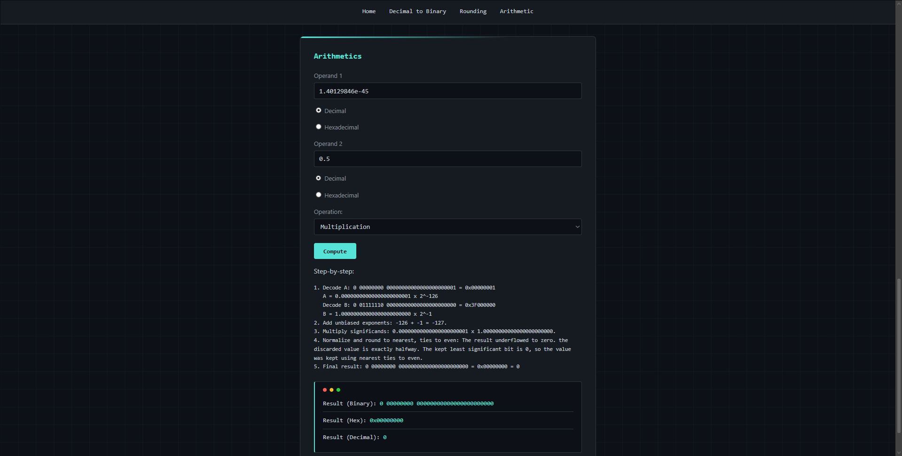
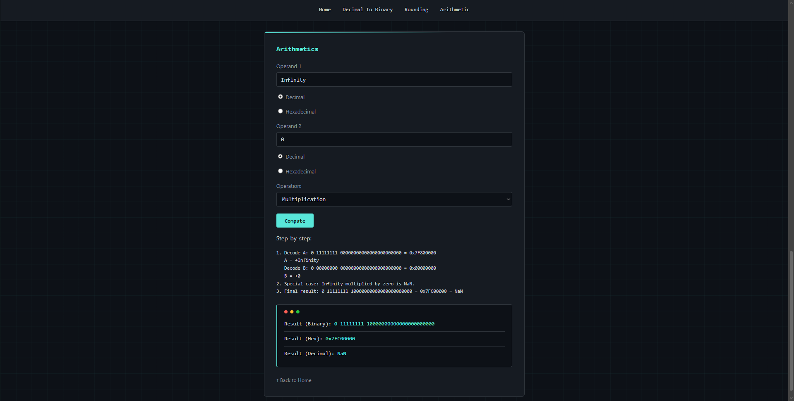

# BitByBit: IEEE 754 Binary 32-bit Floating-Point Machine

BitByBit is a web-based simulator for IEEE 754 binary single-precision numbers. It was developed for the CSARCH2 Simulation Project under **Machine 2: Binary 32-bit Floating-Point Machine**.

The application demonstrates how a 32-bit floating-point value is represented and processed through three main features:

1. Decimal-to-IEEE 754 conversion
2. Binary floating-point rounding
3. IEEE 754 addition and multiplication

## Project links

- **Live website:** [BitByBit IEEE-754 Machine](https://bitbybit-ieee754.netlify.app)
- **Video walkthrough:** [Video](https://youtu.be/daECBjG2fL8?si=mHb-wwAh0pfWSC_9)
- **Complete test-case matrix:** [TEST_CASES.md](TEST_CASES.md)
- **Screenshots:** [Test evidence](screenshots/)

## Features

### 1. Decimal to IEEE 754 conversion

The converter accepts a decimal value and displays its IEEE 754 binary32 representation as:

- 1-bit sign field
- 8-bit biased exponent field
- 23-bit fraction or mantissa field
- Complete binary value with proper spacing
- 8-digit hexadecimal value

It also classifies zero, subnormal values, normalized values, infinity, and NaN based on the exponent and fraction fields.

### 2. Rounding methods

The rounding feature accepts a decimal or binary number and a target number of mantissa bits. It displays the result of all four required methods:

- Chopping or truncation
- Round up, toward positive infinity
- Round down, toward negative infinity
- Round to nearest, ties to even

The implementation checks the discarded portion using the guard bit and sticky bit. For a halfway case, ties-to-even keeps the result when the last retained bit is even and increments it when the last retained bit is odd.

### 3. IEEE 754 arithmetic

The arithmetic feature accepts two operands in either decimal form or 8-digit IEEE 754 hexadecimal form. It supports:

- Addition
- Multiplication

For each operation, the application shows the decoded operands, the main arithmetic steps, normalization, round-to-nearest ties-to-even, and the final result in:

- Binary with `sign exponent mantissa` spacing
- Hexadecimal
- Decimal

Special cases such as NaN, infinity, signed zero, overflow, underflow, and subnormal results are also handled.

## How to run the project

No package installation or build process is required.

1. Download or clone the repository.
2. Open the project folder in a code editor.
3. Start a local web server because the JavaScript files use ES modules.
4. Open the local address in a modern browser.

For example, using Visual Studio Code, install and run the **Live Server** extension, then open `index.html`. If Python is installed, the following command may also be used from the project folder:

```bash
python -m http.server 8000
```

Then visit `http://localhost:8000`.

## How to use the application

### Decimal conversion

1. Go to **Decimal to Binary**.
2. Enter a decimal value.
3. Click **Convert**.
4. Check the sign, exponent, mantissa, spaced binary, and hexadecimal outputs.

### Rounding

1. Go to **Rounding**.
2. Enter a decimal or binary value.
3. Select the correct input format.
4. Enter the number of mantissa bits to retain.
5. Click **Round** to compare all four methods.

### Arithmetic

1. Go to **Arithmetic**.
2. Enter both operands in decimal or IEEE hexadecimal form.
3. Select the correct format for each operand.
4. Choose addition or multiplication.
5. Click **Compute**.
6. Review the step-by-step solution and the final binary, hexadecimal, and decimal results.

## IEEE 754 binary32 format

An IEEE 754 single-precision value uses 32 bits:

| Field | Size | Purpose |
|---|---:|---|
| Sign | 1 bit | `0` for positive and `1` for negative |
| Exponent | 8 bits | Stores a biased exponent using a bias of 127 |
| Fraction | 23 bits | Stores the fractional part of the significand |

For a normalized finite number, the value is interpreted as:

```text
(-1)^sign × (1.fraction) × 2^(exponent - 127)
```

The leading `1` is implicit for normalized numbers, so it is not stored in the 23-bit fraction field. This gives binary32 an effective precision of 24 significant binary bits.

The exponent field also identifies special values:

| Exponent | Fraction | Classification |
|---|---|---|
| `00000000` | All zeroes | Signed zero |
| `00000000` | Nonzero | Subnormal number |
| `00000001` to `11111110` | Any | Normalized finite number |
| `11111111` | All zeroes | Positive or negative infinity |
| `11111111` | Nonzero | NaN |

## Analysis

### Decimal conversion

The conversion feature shows why many decimal values cannot be stored exactly in binary. Values composed of powers of two, such as `12.375`, have an exact finite binary expansion:

```text
12.375 = 1100.011₂ = 1.100011₂ × 2³
```

The sign is `0`, the stored exponent is `3 + 127 = 130`, or `10000010₂`, and the fraction is filled with the bits after the leading `1`. The resulting representation is:

```text
0 10000010 10001100000000000000000
0x41460000
```

Other decimal fractions, such as `0.1`, repeat indefinitely in binary. Since binary32 has only 23 stored fraction bits, the exact expansion must be rounded. This is why the decimal value recovered from a floating-point bit pattern may differ slightly from the original input.

### Rounding behavior

The four rounding methods can produce different results when discarded bits are nonzero. Chopping always removes the discarded bits. Round-up and round-down depend on the sign because they move toward positive and negative infinity, respectively.

Round-to-nearest ties-to-even minimizes accumulated rounding bias. If the discarded portion is more than halfway, the retained value is incremented. If it is less than halfway, it is kept. For an exact halfway case, the least significant retained bit determines the result:

- `1.101₂` rounded to two fraction bits becomes `1.10₂` because the retained least significant bit is even.
- `1.111₂` rounded to two fraction bits becomes `10.00₂` because `1.11₂` has an odd retained least significant bit and is incremented.

These cases show that ties-to-even does not simply round every halfway value upward.

### Addition

Floating-point addition first requires the operands to use a common exponent. The significand of the operand with the smaller exponent is shifted before the significands are added. The exact sum is then normalized and rounded back to binary32 precision.

For example:

```text
1.5 + 2.25 = 3.75
3.75 = 1.111₂ × 2¹
Result: 0 10000000 11100000000000000000000
Hex:    0x40700000
```

This process can cause a small operand to lose significance when it is added to a much larger operand because alignment may shift all of its significant bits beyond the available precision. Exact cancellation, such as `1 + (-1)`, produces zero.

### Multiplication

Floating-point multiplication determines the result sign using the operand signs, multiplies the significands, and adds the unbiased exponents. The product is then normalized and rounded to fit the 23-bit fraction field.

For example:

```text
1.5 × 2.25 = 3.375
3.375 = 1.1011₂ × 2¹
Result: 0 10000000 10110000000000000000000
Hex:    0x40580000
```

Multiplication can overflow when the final exponent exceeds the largest finite binary32 exponent. It can also underflow into the subnormal range or signed zero when the magnitude is too small.

### Special and edge cases

The tests include signed zero, the smallest and largest subnormal values, the smallest normal value, the maximum finite value, infinity, NaN, overflow, and underflow. These cases are important because IEEE 754 does not process all bit patterns as ordinary normalized numbers.

Examples of required special-case behavior include:

- `+Infinity + (-Infinity)` produces NaN.
- `Infinity × 0` produces NaN.
- A finite nonzero value multiplied by infinity produces signed infinity.
- Multiplication by zero uses the operand signs to determine positive or negative zero.
- Overflow produces signed infinity.
- A result below the smallest representable subnormal value rounds to signed zero.

The project uses `0x7FC00000` as its canonical quiet-NaN output. IEEE 754 permits other NaN bit patterns as long as the exponent is all ones and the fraction is nonzero.

### Test-case analysis

The test matrix contains **35 cases** divided into three groups. Testing on August 2, 2026 produced **30 passes and 5 failures**:

| Feature | Number of cases | Passed | Failed |
|---|---:|---:|---:|
| Decimal conversion | 12 | 9 | 3 |
| Rounding | 8 | 8 | 0 |
| Arithmetic | 15 | 13 | 2 |
| **Total** | **35** | **30** | **5** |

Each case records the expected output, actual output, and pass/fail status in [TEST_CASES.md](TEST_CASES.md). The screenshots below demonstrate representative normal, special, and edge cases from the tested deployment.

## Screenshots

### Decimal-to-IEEE 754 conversion





### Rounding





### Arithmetic









Additional evidence is available for [negative zero conversion](screenshots/conversion-negative-zero.png) and [hexadecimal arithmetic input](screenshots/hexadecimal-input.png).

## Project structure

```text
ieee754-machine/
├── index.html                 # Web interface
├── style.css                  # Page styling
├── js/
│   ├── convertDecimal.js      # Decimal-to-binary32 conversion
│   ├── rounding.js            # Four rounding methods
│   └── arithmetic.js          # Addition and multiplication
├── TEST_CASES.md              # Test-case matrix and results
├── screenshots/               # Captured test evidence
└── README.md                  # Documentation and analysis
```

## Technologies used

- HTML5
- CSS3
- JavaScript ES modules
- JavaScript `Float32Array`, `DataView`, and `BigInt`

`Float32Array` is used to obtain the binary32 encoding of decimal inputs. `DataView` converts final 32-bit patterns back into decimal values for display. `BigInt` is used during arithmetic so intermediate integer coefficients can be processed without losing precision before the final IEEE 754 rounding step.

## Testing and verification

The expected outputs are documented in [TEST_CASES.md](TEST_CASES.md). Before final submission:

1. Run all 35 cases using the deployed application.
2. Record each actual result and mark it as Pass or Fail.
3. Verify the arithmetic step-by-step output as well as the final answer.
4. Retest the five failed cases after the implementation is corrected.
5. Add the accessible YouTube walkthrough to the repository.

## Known limitations before final submission

- The YouTube walkthrough link still needs to be added.
- The decimal-conversion input and parser must accept the literal values `NaN`, `Infinity`, and `-Infinity` so the required special cases can be demonstrated through the interface.
- The rounding interface currently references undefined radio-button variables during input handling and must be corrected before final testing.
- Arithmetic shows the main IEEE 754 stages, but the group may expand the displayed aligned significands and intermediate result if a more detailed step-by-step trace is required.

## Contributors

**Group 2, Section S02**

- Aaron Romero
- Jonah Pajarillo
- Justine Po Major
- Luis Andre Vito
- Rance Laus

The group divided the project work among IEEE 754 conversion, rounding, arithmetic, interface integration and deployment, and documentation. The documentation work includes the test-case matrix, test execution, screenshots, README and analysis write-up, and video editing.

## Course information

- **School:** De La Salle University
- **Course:** CSARCH2
- **Section:** S02
- **Professor:** Roger Uy
- **Project:** Simulation Project, Case Project: Computing Machine
- **Machine:** Machine 2, Binary 32-bit Floating-Point Machine
- **Academic term:** 3rd Term, AY 2025–2026
